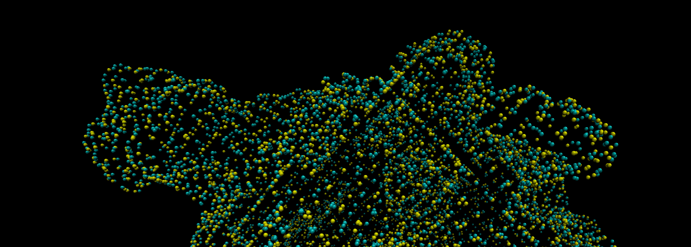

# 🌠 GENIUSES: Grid-Robust Efficient Neural Interface Model for Universal Molecule Surface Construction from Point Clouds


If you use this code, please cite the paper using the BibTeX reference below.

```bibtex
@article{wu2023grid,
  title={Grid-Robust Efficient Neural Interface Model for Universal Molecule Surface Construction from Point Clouds},
  author={Wu, Yongxian and Wei, Haixin and Zhu, Qiang and Luo, Ray},
  journal={The Journal of Physical Chemistry Letters},
  volume={14},
  pages={9034--9041},
  year={2023},
  publisher={ACS Publications}
}
```

## Dependencies
**Requirements**

- Python >= 3.9

- Packages
    ```bash
    pip install -r requirements.txt
    ```

## Dataset
For the whole dataset, it contains following directories:
```
benchmark_data_0.5
├── bench_bnd_0.55
│   ├── case_1a
│   ├── case_1b
│   ├── case_1c
│   ├── case_1d
│   ├── case_1e
│   ├── case_1f
│   ├── case_1g
│   ├── case_1h_1i
│   ├── case_1j_1n
│   ├── case_1o_1q
│   ├── case_1r_1z
│   └── case_2_7
└── bench_full_0.35
    ├── case_1a
    ├── case_1b
    ├── case_1c
    ├── case_1d
    ├── case_1e
    ├── case_1f
    ├── case_1g
    ├── case_1h_1i
    ├── case_1j_1n
    ├── case_1o_1q
    ├── case_1r_1z
    └── case_2_7

26 directories
```

After filtering all too negative points, we get the positive part dataset (i.e. all points with value > -1.5), which contains following directories:
```
benchmark_data_0.5_pos_part
├── bench_bnd_0.55
│   ├── case_1a
│   ├── case_1b
│   ├── case_1c
│   ├── case_1d
│   ├── case_1e
│   ├── case_1f
│   ├── case_1g
│   ├── case_1h_1i
│   ├── case_1j_1n
│   ├── case_1o_1q
│   ├── case_1r_1z
│   └── case_2_7
└── bench_full_0.35
    ├── case_1a
    ├── case_1b
    ├── case_1c
    ├── case_1d
    ├── case_1e
    ├── case_1f
    ├── case_1g
    ├── case_1h_1i
    ├── case_1j_1n
    ├── case_1o_1q
    ├── case_1r_1z
    └── case_2_7

26 directories
```

## Training
To train the model on all dat files:
```bash
sh script/train.sh
```

To train the model on only positive dat files (i.e. all points with value > -1.5):
```bash
sh script/train_pos_model.sh
```

To eval the model on desired dat files:
```bash
sh script/eval.sh
```
